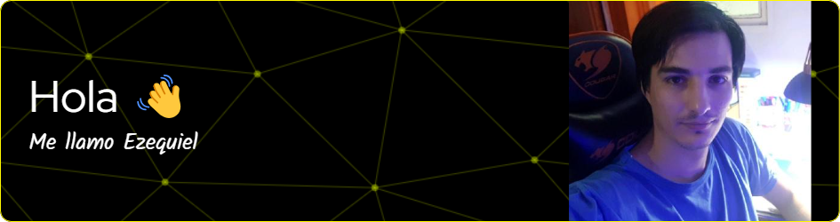

Estudio programación y empecé a desarrollar soluciones desde el 2018 (aunque mi primer producto lo lancé en 2023).

Siempre pienso cuál es la forma más simple de solucionar un problema. Muchas veces es difícil. Otras veces no se consigue 🫤. Pero intento de que sea simple para el usuario poder usar las herramientas que ofrezco.

> Actualmente uso las siguientes tecnologías en mi día a día:
> 
>
> Estoy estudiando estas tecnologías para futuros proyectos:
> 

Actualmente estoy manteniendo y mejorando el siguiente proyecto:

## 📊 Mis estadísticas en Github
 
 

Mi idea es poder crear soluciones que solucionen un problema en concreto en mi ciudad natal (Paraná, Entre Ríos, Argentina) para luego poder llevarlo a otras ciudades.

Te dejo mis redes para que puedas contactarte conmigo:

   

